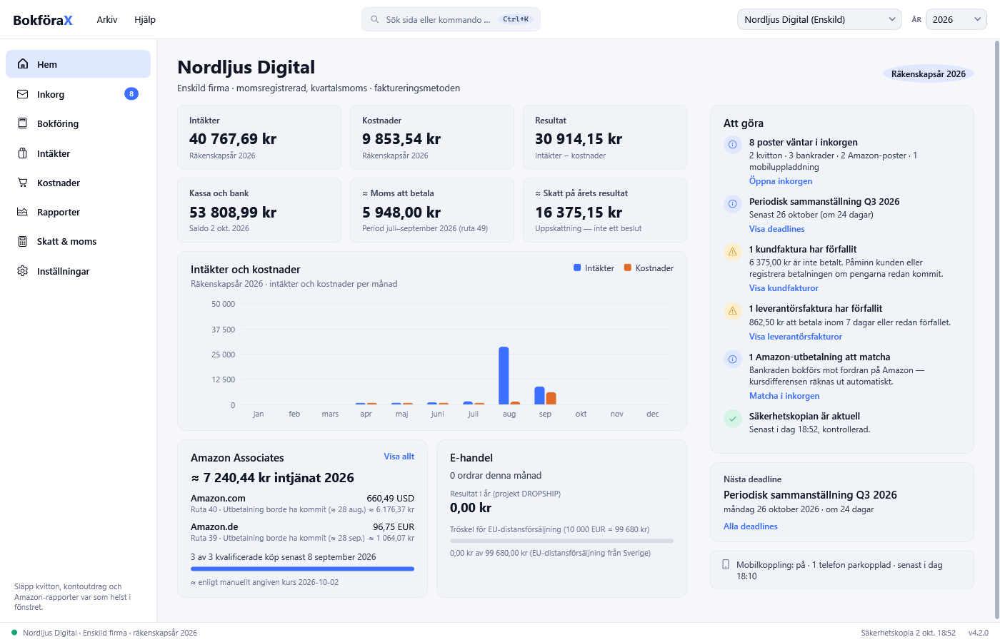
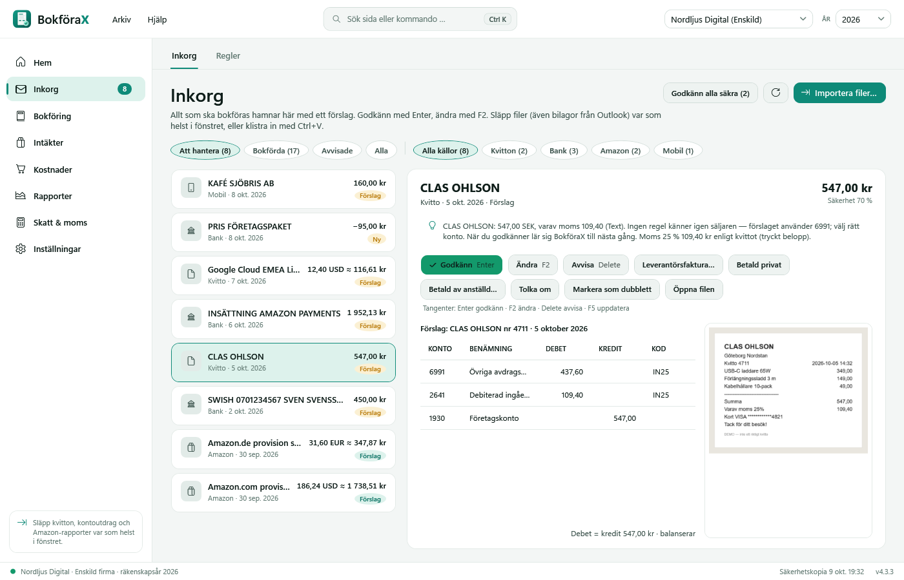
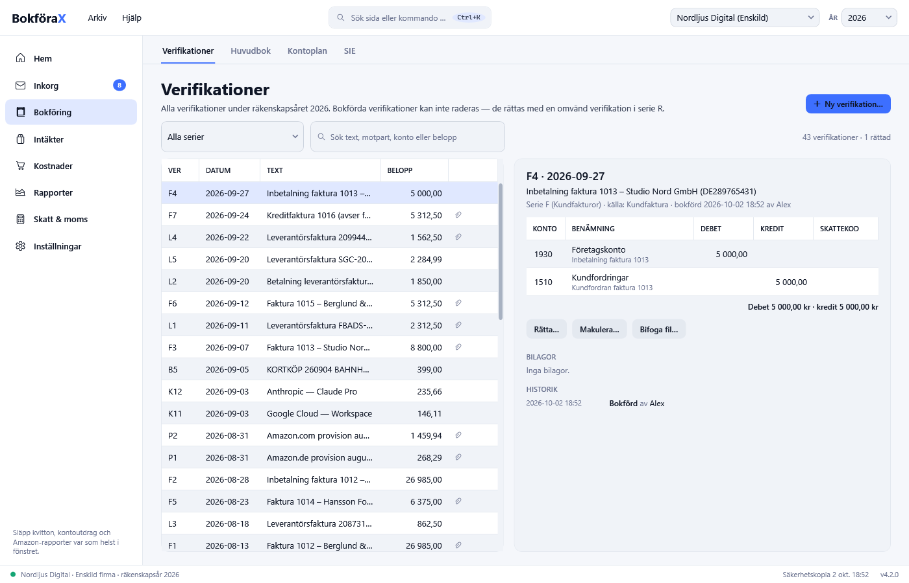
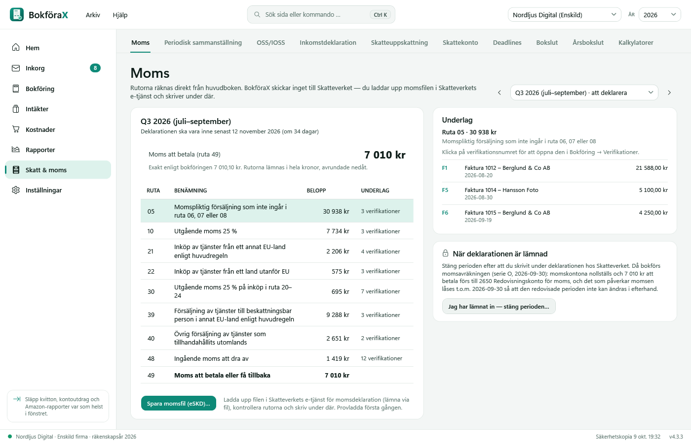
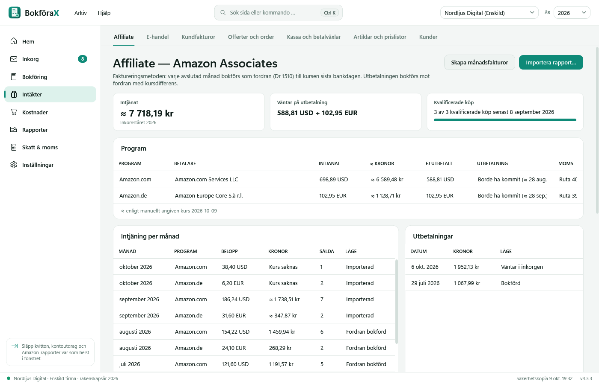
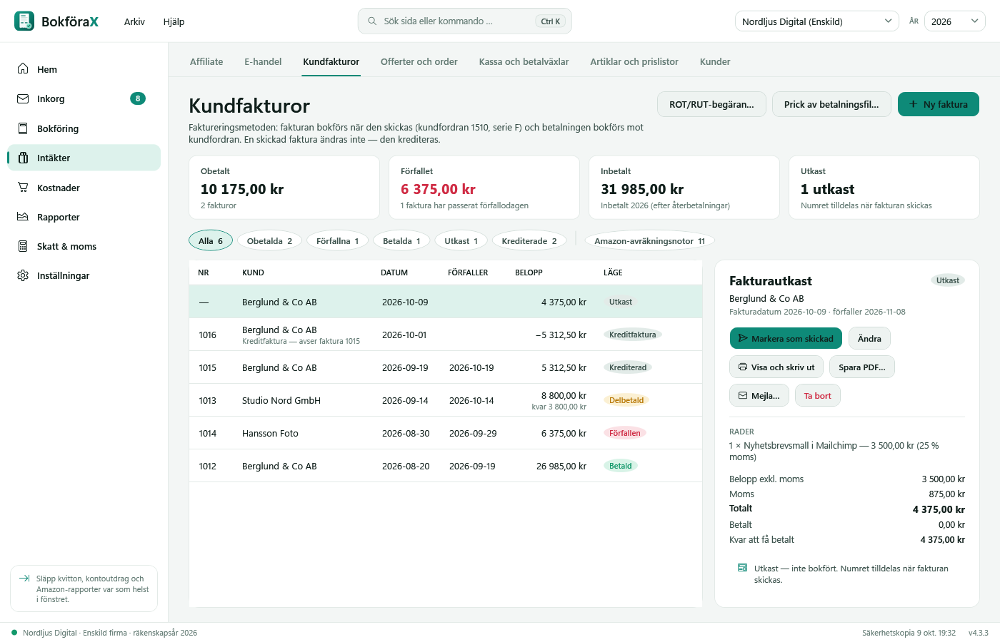
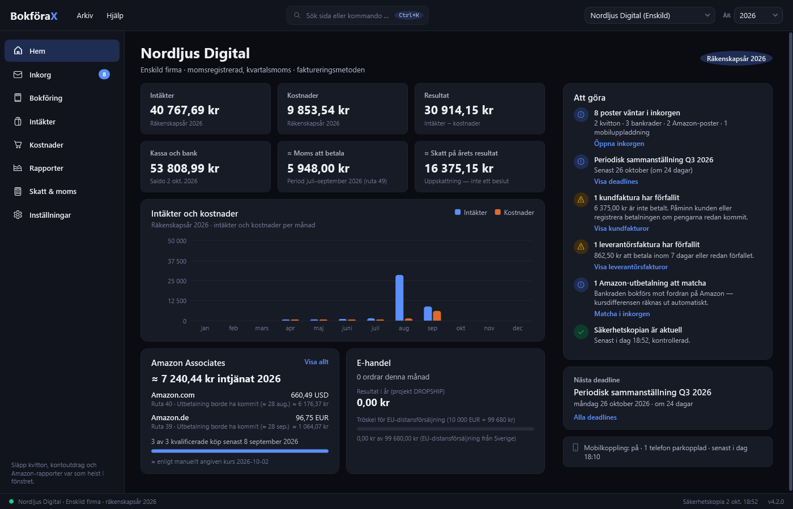

# BokföraX

**Bokföring för svenska enskilda firmor och små aktiebolag** — webbplats: **[bokforax.se](https://bokforax.se)** — byggd efter svenska regler: bokföringslagen, moms med
alla rutor, SIE 4 och filerna till Skatteverket.

> **Testversion.** BokföraX är under utveckling och testas nu av fler. Prova gärna och berätta vad som fungerar och vad
> som inte gör det — se [Synpunkter och felrapporter](#synpunkter-och-felrapporter). Programmets källkod är inte publik.

## Vad BokföraX gör

- **En inkorg för allt** — kvitton, kontoutdrag och rapporter hamnar i Inkorgen med ett färdigt förslag. Du godkänner
  med **Enter**, ändrar med **F2**. Regler lär sig av dina val.
- **Riktig bokföring** — verifikationer i serier, rättelser i stället för radering, låsta perioder, revisionslogg,
  huvudbok och kontoplan (BAS).
- **Moms** — momsdeklarationen med alla rutor, periodisk sammanställning, omvänd moms, OSS, och filen till
  Skatteverket.
- **Fakturor** — kundfakturor med egen logotyp, kreditfakturor, leverantörsfakturor och betalningar.
- **Affiliate och e-handel** — Amazon Associates (utbetalningar per marknadsplats, valutakurser från Riksbanken) och
  import från Shopify, Stripe och PayPal.
- **Deklaration och bokslut** — NE, INK2, INK3 och INK4 med SRU-filer, K10, bokslut med periodiseringsfond och
  överavskrivningar, årsredovisning enligt K2 eller K3, och SIE 4-export till din revisor.
- **Lön** — Skatteverkets skattetabeller, arbetsgivardeklaration (AGI), semester, sjuklön, förmåner, traktamente,
  kollektivavtal och lönebesked.
- **Automatisering** — bankavstämning, OCR-nummer och avprickning av betalningar, betalfil till banken, påminnelser,
  återkommande fakturor, offerter och order, lager, budget, e-postinkorg för kvitton, och rapporter från Klarna,
  Zettle, SumUp, Swish, Etsy och WooCommerce.
- **Alla bolagsformer** — enskild firma, handels- och kommanditbolag, aktiebolag, ekonomisk och ideell förening.
- **Säkerhetskopior** — dagliga kopior som kontrolleras, och återställning med ett klick.

| | |
|---|---|
|  |  |
|  |  |
|  |  |

## Dina uppgifter stannar hos dig

Bokföringen sparas **på din egen dator**. Ingenting skickas till BokföraX:s utvecklare — inga konton, ingen molntjänst,
ingen spårning. Det enda programmet hämtar själv från nätet är valutakurser (Riksbanken/ECB). Allt annat sker bara
om du själv ställer in det. Ta gärna säkerhetskopior
till ett USB-minne under **Inställningar → Säkerhetskopiering**.
Hela integritetspolicyn: [INTEGRITET.md](INTEGRITET.md).

## Kan jag lita på programmet?

Källkoden är inte publik, så här är det du behöver veta — och hur du själv kan kontrollera det.

**Vad BokföraX gör med nätet.** Programmet kontaktar självt bara två adresser: **Riksbanken** (`api.riksbank.se`) och
**Europeiska centralbanken** (`data-api.ecb.europa.eu`) för valutakurser. Inget annat — ingen inloggning, inget konto,
ingen statistik eller spårning, ingen uppdateringskoll som skickar uppgifter. Det här sker bara om **du själv** ställer
in det: att skicka fakturor med **din** e-post, att hämta kvitton från **din** e-postinkorg, att koppla till en **egen**
server, webhooks till adresser **du** anger, och AI-assistenten (avstängd från början) som använder Claude från
Anthropic med **din egen** API-nyckel.
*Kontrollera själv:* koppla bort datorn från internet — BokföraX fungerar fullt ut, bara utan nya valutakurser.

**Var dina uppgifter ligger.** Allt sparas på din dator i `%AppData%\BokforaPro` (namnet från tiden före BokföraX).
Säkerhetskopiorna hamnar i samma mapp, och du kan välja en extra plats, till exempel ett USB-minne. Avinstallerar du
programmet ligger bokföringen kvar.

**Skannad efter virus.** Varje installationsfil skannas med Microsoft Defender innan den läggs upp här (4.3.3: inga
fynd). 4.2.0 kontrollerades också på VirusTotal (51 av 52 rena, ett maskininlärningsfalsklarm — se nedan).

**Säkerhetsgranskad.** Programmet har granskats av flera oberoende granskningar med fokus på säkerhet (inloggningar,
filer, nätverk) inför testversionen. Alla allvarliga och medelallvarliga fynd är rättade. Hittar du en brist:
rapportera privat enligt [SECURITY.md](SECURITY.md).

**Testat.** Varje version testas automatiskt med över 2 000 tester (moms, bokföring, SIE, filer, säkerhet) innan den
släpps, och startas på riktigt innan installationsfilen byggs.

**Vem står bakom.** BokföraX utvecklas av en privatperson i Sverige, Nader, som själv använder programmet för sin
bokföring. Frågor och synpunkter tas emot under [Issues](../../issues).

## Bra att veta innan du installerar

**"Windows skyddade datorn"** — installationsfilen på GitHub är inte kodsignerad. Därför känner Windows inte igen
utgivaren och varnar. Klicka **Mer info → Kör ändå**, eller installera från **Microsoft Store** (se *Installera*), där
varningen inte visas.

**Är filen säker?** Det är förståeligt att vara försiktig med en .exe-fil från nätet. Så här kan du kontrollera den:

- **Antivirus:** installationsfilen för 4.3.3 är skannad med Microsoft Defender (virusdefinitioner 1.459.636.0) utan
  fynd. Du kan själv högerklicka på filen → **Skanna med Microsoft Defender**.
- **VirusTotal** (ett 50-tal antivirusprogram på en gång): **51 av 52 hittar ingenting** —
  [se resultatet för 4.2.0](https://www.virustotal.com/gui/file/f5d04367fe20d6c4db36db44d3642eabdf22b3724f14cd68e2bab76f5f8ca04e). Ett enda program (Trapmine) ger en
  maskininlärningsgissning, *"Malicious.moderate.ml.score"* — ingen känd virussignatur, utan en gissning utifrån hur
  filen är byggd. Sådana falsklarm är vanliga för nya installationsprogram som inte är kodsignerade ännu.
  VirusTotal körde också filen i en provmiljö (CAPE Sandbox): **inga misstänkta beteenden och ingen nätverkstrafik** —
  den packar bara upp sina egna installationsfiler. De 100 programfiler som ingår (bland annat Microsofts .NET-filer)
  har 0 träffar. Utvecklarens kommentar om filen finns under
  [Community på VirusTotal](https://www.virustotal.com/gui/file/f5d04367fe20d6c4db36db44d3642eabdf22b3724f14cd68e2bab76f5f8ca04e/community).
- **Att filen är oförändrad:** kör i PowerShell `Get-FileHash .\BokforaX-Setup-4.3.3.exe` — svaret ska vara
  `F7F032E051EEE7E848634D59990B15896E7E80AA02501FEC7F55A5651378CEE9` (står också under Releases).
- **Hämta bara härifrån.** BokföraX sprids inte någon annanstans.

**Inget demoläge ännu.** Det finns inget färdigt påhittat företag att prova med. Vill du testa utan dina riktiga
uppgifter: hitta på ett företag i välkomstguiden (till exempel "Testfirma") och mata in några påhittade kvitton och
fakturor. Ett demoläge kommer i en senare version.

## Installera

### Från Microsoft Store (rekommenderas)

**[BokföraX i Microsoft Store](https://apps.microsoft.com/detail/9PD1DB9QQFGM)**: klicka **Hämta**, så installeras
BokföraX och uppdateras sedan av sig själv. Ingen varning från Windows, eftersom Microsoft har kontrollerat och signerat
programmet.

### Från GitHub

1. Gå till **[Releases](../../releases/latest)** och ladda ner `BokforaX-Setup-<version>.exe`.
2. Kör filen. Visar Windows **"Windows skyddade datorn"**: klicka **Mer info → Kör ändå** (se ovan).
3. Följ installationen. Första gången frågar en kort guide vad som gäller för dig (enskild firma eller aktiebolag,
   moms, vad du gör).

Installera bara på ett av sätten. Store-versionen och GitHub-versionen är samma program.

**Krav:** Windows 10 eller 11 (64-bitars). Inget annat behöver installeras.

### iPhone-appen

**[BokföraX i App Store](https://apps.apple.com/se/app/bokf%C3%B6rax/id6818613018)**: fota kvitton, se översikten och
godkänn i mobilen. Appen kopplas till BokföraX på din dator (eller till en egen BokföraX-server) med en engångskod
under **Inställningar → Mobilkoppling** i Windows-programmet. Vill du bara titta först: tryck **Prova med demodata**
i appen, så visas ett påhittat företag utan koppling. **Krav:** iPhone med iOS 26 eller senare.

## Synpunkter och felrapporter

Allt är välkommet — fel, konstiga siffror, otydliga texter och idéer.

1. Öppna **[Issues](../../issues)** → **New issue**.
2. Välj **Felrapport** eller **Förslag** och fyll i fälten.

Skriv versionen (**Hjälp → Om BokföraX**) och hur felet går att upprepa. **Bifoga aldrig riktig bokföring, riktiga
kvitton, personnummer eller kontonummer** — använd påhittade uppgifter. Mer i
[FEEDBACK.md](FEEDBACK.md). En **säkerhetsbrist** rapporteras privat enligt [SECURITY.md](SECURITY.md).

## Licens

BokföraX är gratis att använda — även för din riktiga bokföring i din egen verksamhet — men får **inte säljas, hyras ut
eller spridas vidare**. Hämta alltid programmet härifrån. Villkoren på vanlig svenska: [LICENS.md](LICENS.md); det är
licenstexten i [LICENSE](LICENSE) (PolyForm Internal Use 1.0.0) som gäller.

Programmet levereras i befintligt skick, utan garantier. Ansvaret för bokföringen och deklarationerna är alltid ditt —
kontrollera siffrorna innan du skickar något till Skatteverket.

BokföraX hette tidigare BokföraPro (till och med version 4.1).
